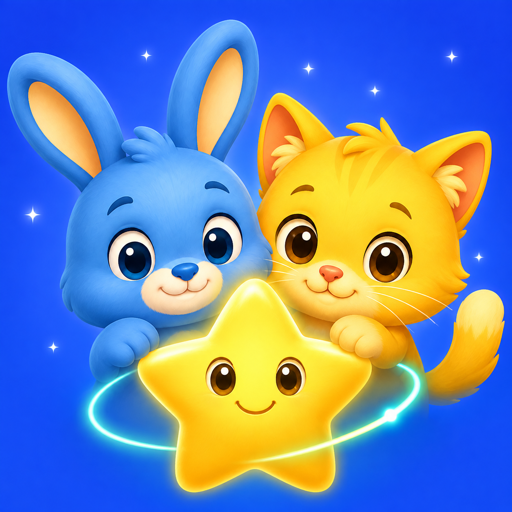
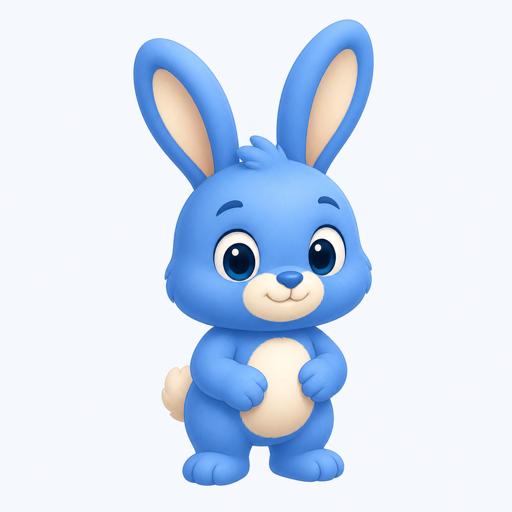
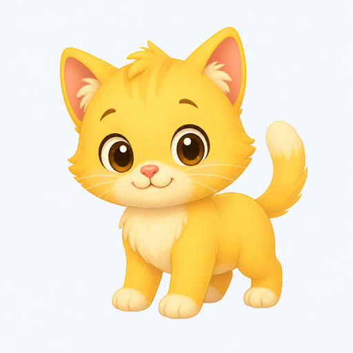
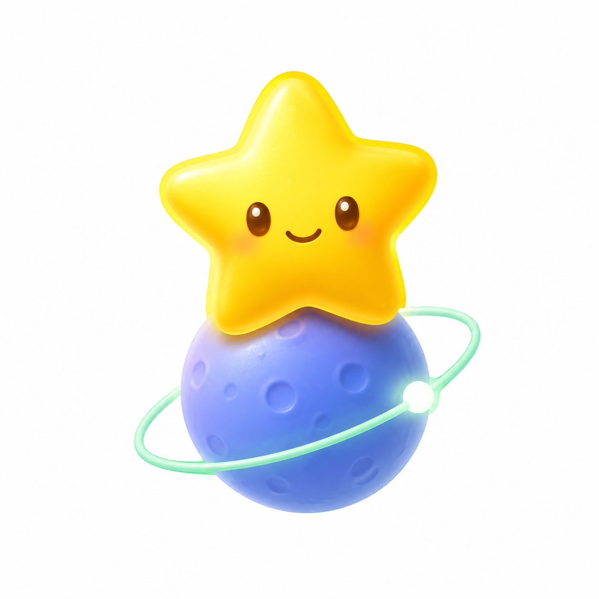

# 专注星伴：产品总览

> 文档版本：V1.0 · 2026-09-04  
> 当前阶段：跨平台 MVP，20 个训练可玩，陪伴与端侧观察进入真机验证

## 1. 产品定义

专注星伴是一款面向 3–16 岁儿童与学生的专注力训练与健康学习陪伴应用。产品通过短时游戏化训练、番茄节奏、休息提醒、距离与姿态辅助提醒，以及家长可理解的成长报告，帮助孩子逐步形成更稳定、舒服、可持续的学习习惯。

产品不进行智力、疾病或医学诊断，也不把摄像头信号直接解释为“认真”或“不认真”。训练成绩和观察数据用于发现个人趋势、提供温和反馈，而不是评价孩子。

## 2. 目标用户与核心场景

### 儿童与学生

- 3–6 岁：短时、低文字、强视觉和语音引导。
- 7–9 岁：通过明确目标和即时反馈建立训练习惯。
- 10–12 岁：提升持续、选择和任务切换能力。
- 13–16 岁：用于作业、阅读和阶段复习的自主专注管理。

### 家长

- 了解训练是否持续、哪些能力维度正在改善。
- 获得陪伴时长、休息执行、距离和姿态提醒等摘要。
- 不需要远程观看孩子，也不需要浏览本地录像。

### 高频场景

- 每日完成约 5 项服务端下发的短训练。
- 写作业、阅读、网课时开启 10–25 分钟星陪伴。
- 一轮结束后休息、望远、喝水并查看简短反馈。
- 家长按日、近 7 天、近 30 天查看变化趋势。

## 3. 核心价值

1. **练能力**：用短游戏覆盖五类注意能力，而非只提供倒计时。
2. **陪过程**：把专注、坐姿自检和休息节奏放在同一个闭环中。
3. **看成长**：强调与孩子过去阶段相比的变化，不做公开排名。
4. **守隐私**：端侧处理临时相机帧，不录像、不上传原始图片、不做人脸身份识别。
5. **跨设备连续**：每日计划、完成进度和最佳成绩可由服务端同步。

## 4. 一级产品结构

### 星训练

- 今日训练计划与中断续做。
- 五维训练目录。
- 单局教程、游戏过程、暂停/退出、结果反馈。
- 当前已有 20 个可玩游戏。

### 星陪伴

- 屏幕学习、桌面作业、阅读时间三种模式。
- 1 分钟真机快测及 10、15、20、25 分钟常规时长。
- 暂停、提前完成、自动休息、跳过休息、喝水和坐姿自检提醒。
- Android/iOS 可选端侧观察：在屏、距离、画面位置和头部偏转。
- 上半身坐姿检测规划：耳、肩、髋关键点与个人自然坐姿基线。

### 星小屋

- 成长报告、训练历史、最近陪伴记录。
- 儿童档案与设置。
- 后续承载装饰成长、家庭建议和隐私控制。

## 5. 五维训练体系

| 维度 | 训练目标 | 已有代表游戏 |
| --- | --- | --- |
| 集中注意 | 快速聚焦目标和定位线索 | 星星捕手、影子配对、光点追踪、声音在哪里 |
| 持续注意 | 在一段时间内维持稳定投入 | 星空守望员、找出变化、小车巡逻、呼吸小星球 |
| 选择注意 | 从干扰中筛选目标信息 | 颜色指令、森林寻宝、图案侦探、声音过滤器 |
| 转换注意 | 在规则或任务之间灵活切换 | 魔法规则、红绿指令、分类车站、奇偶轨道 |
| 分配注意 | 协调两类以上线索或任务 | 双轨任务、记忆与搜索、一心二用小司机、听声找图 |

评分应保存正确率、遗漏、误触、反应时间及波动等原始指标，再基于年龄段和个人基线生成成长反馈。MVP 分数只用于流程验证。

## 6. 端侧观察与坐姿辅助

当前前置相机能力默认关闭，由家长主动开启。页面最多每 3 秒分析一帧，原始帧分析后立即释放。

### 当前可用

- 面部是否进入画面。
- 距离是否过近或过远。
- 是否偏离画面中央。
- 头部持续转动、侧倾或俯仰。
- 连续丢失后判断是否离开观察范围。

### 下一阶段

Android/iOS 统一引入人体关键点模型，基于耳朵、肩膀和髋部判断头部侧倾、双肩高低、身体倾斜和明显前倾。系统先采集自然坐姿基线；异常需连续存在数秒才提醒。关键点不完整时返回“无法判断”，不得误报为错误坐姿。

家长侧只查看汇总数据，如稳定在屏比例、过近秒数、姿态提醒次数和休息完成情况，不提供远程视频入口。

## 7. 数据与服务端能力

正式版的核心服务端能力包括：

- 登录后的每日训练计划下发与多端同步。
- 未完成计划跨天保留，完成后可主动切换到新一天。
- 单题结果提交、重复提交和仅保留最佳成绩。
- 单日或多日报告，以及同一训练上一次成绩对比。
- 近 7 天、近 30 天、阶段变化和五维能力报告。
- 资源包清单、后台异步补全、失败重试和低资源量降级循环。

详细接口见 [SERVER_API_DESIGN.md](SERVER_API_DESIGN.md)。

## 8. 品牌与视觉语言

- **跃跃（蓝兔）**：训练、探索、行动和安全守护；角色全名“星跃”仅在完整角色介绍中使用。
- **暖暖（黄猫）**：陪伴、鼓励、休息和成长反馈；角色全名“星暖”仅在完整角色介绍中使用。
- **星伴双星**：跃跃与暖暖的组合名称；普通界面和对话优先使用“跃跃和暖暖”，品牌活动、角色合影和专题内容可使用“星伴双星”。
- **发光星星**：把专注呈现为可以一点点积累的能力。
- **星球轨道**：代表持续训练、规律节奏和长期成长。
- **主色**：星际蓝、阳光黄、薄荷绿和奶油白。
- **表达方式**：温和、清楚、非评判；避免红色警报、监控感和医学化措辞。

## 9. 当前完成度

- 3 个一级 Tab 与品牌角色入口已完成。
- 20/20 个规划训练已可玩，32 个页面进入 Android 编译链路。
- 每日训练基础闭环、结果和本地历史可用。
- 星陪伴计时、暂停、休息、自检提醒和本地记录可用。
- Android/iOS 面部端侧插件已建立，正在进行真机兼容与阈值校准。
- 服务端 V1 接口讨论稿已完成。
- App Icon V1 与基础角色素材包已整理。

## 10. 上线前重点

1. 统一 20 个游戏的教程、暂停、退出与异常恢复。
2. 完成 Android/iOS/HarmonyOS NEXT 真机矩阵和耗电测试。
3. 校准评分、无效局识别和不同年龄段参数。
4. 完成家长授权、儿童隐私说明、数据删除/导出与第三方 SDK 清单。
5. 接入服务端每日计划、最佳成绩、报告和资源包补全。
6. 用真实家庭测试验证提醒频率、误报率、持续使用率和报告可理解性。

## 11. 建议核心指标

- 首次建档完成率。
- 今日计划开始率与完成率。
- 次日、7 日和 30 日留存。
- 星陪伴完整轮次比例与休息完成率。
- 端侧观察有效帧比例、误报反馈率和关闭率。
- 家长报告查看率及建议理解度。
- 同一训练在连续阶段中的稳定性变化。

## 12. 产品边界

- 不宣称治疗 ADHD 或其他疾病。
- 不用单次分数评价智力、性格或学习态度。
- 不保存或远程查看儿童视频。
- 不使用人脸身份识别、陌生人社交、公开排名或个性化广告。
- 涉及摄像头和儿童数据的正式上线版本必须完成适用地区的法律与儿童隐私合规评审。
